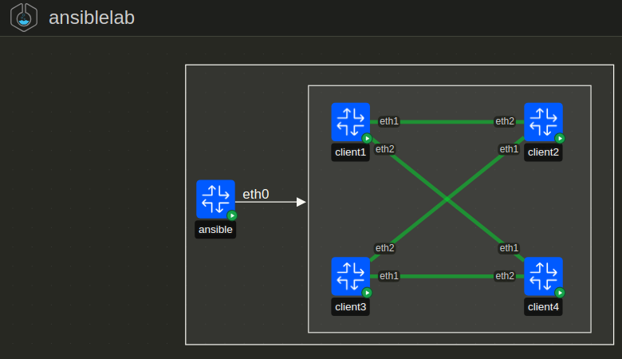

# Ansible
- It is an application that can run on a server or desktop.
- It supports Windows (WSL) or Linux.
- Ansible is agentless.
- Main propuse is the automation of massive deployment of infrastructure by configuring servers, switches, routers, etc.
- It uses the concept of **task** for any specific objective we want to achieve. i.e. Installing docker in 50 servers.
- To be able to execute the `task`, it is required an **inventory** where all host IPs, users, passwords will be allocated.
- With the task or list of tasks and the inventory, during the execution Ansible will connect in parallel to all devices and execute each task in a sequential way.
- **Idempotent behaviour**:  ensures that performing an operation multiple times produces the same result as performing it once, preventing unintended side effects from repeated actions.
- All files are in **yaml** formatting.
- **Playbook**: Defines a list of tasks, which machines we want to connect to by pointing them from our inventory.
- **Variables**: Additional information used to deploy information host specific or group specific.
- **Configuration file**: it is the `ansible.cfg` file use to set global parameter to be able to run the playbook without any issue. i.e: disable ssl certificates, connect under specific conditions.

## Package and version
There are 2 packages available from Ansible community:
- **ansible-core**: a minimalist language and runtime package containing a set of built-in modules and plugins.
- **ansible**:  a much larger “batteries included” package, which adds a community-curated selection of Ansible Collections for automating a wide variety of devices.

## Installing ansible in ubuntu server
- Install ansible
```sh
#Ubuntu command
sudo apt install ansible -y
```
- Configure password less in between ansible machine and target machines
```sh
ssh-keygen -t rsa -b 4096 -C "your_email@example.com"
#OPTIONAL BUT POTENTIALLY NEEDED
chmod 600 ~/.ssh/id_rsa
#Copy ssh-key from origin to any destination server/container/VM/host computer
ssh-copy-id -i ~/.ssh/id_rsa.pub tim@just.some.other.server
```
- Check Ansible version:
```sh
ansible --version
ansible-community --version
```

## Installing with Pip
### Prerequisites
- Python3
- Pip

### Procedure
- Verify if pip is installed:
```sh
python3 -m pip -V
```
- Install Ansible:
```sh
python3 -m pip install --user ansible
python3 -m pip install --user ansible-core
python3 -m pip install --user argcomplete
```
- Upgrade Ansible (Optional):
```sh
python3 -m pip install --upgrade --user ansible
```
- Configure passwordless in between ansible machine and target machines
```sh
ssh-keygen -t rsa -b 4096 -C "your_email@example.com"
#OPTIONAL BUT POTENTIALLY NEEDED
chmod 600 ~/.ssh/id_rsa
#Copy ssh-key from origing to any destination server/container/VM/host computer
ssh-copy-id -i <ssh-key> <user>@<host>
```
- Check Ansible version:
```sh
ansible --version
ansible-community --version
```

## Configuring environment topology
- Install `containerlab`:
```sh
curl -sL https://containerlab.dev/setup | sudo -E bash -s "all"
```
- Create custom docker images for ansible container and client containers:
```sh
#Docker file for ubuntu server where ansible will be installed
FROM ubuntu

RUN apt-get update &&\
    apt install python3 ansible openssh-server vim iputils-ping iproute2 sudo -y
RUN useradd -m -s /bin/bash ansible && \
    echo "ansible:ansible" | chpasswd && \
    adduser ansible sudo
RUN mkdir /var/run/sshd
RUN sed 's@session\s*required\s*pam_loginuid.so@session optional pam_loginuid.so@g' -i /etc/pam.d/sshd
RUN echo "export VISIBLE=now" >> /etc/profile
 
EXPOSE 22
CMD ["/usr/sbin/sshd", "-D"] 

#Docker file for client container
FROM ubuntu
RUN apt-get update &&\
    apt install python3 ssh vim iproute2  openssh-server vim iputils-ping iproute2 sudo -y
RUN useradd -m -s /bin/bash client && \
    echo "client:client" | chpasswd && \
    adduser client sudo
RUN mkdir /var/run/sshd
RUN sed 's@session\s*required\s*pam_loginuid.so@session optional pam_loginuid.so@g' -i /etc/pam.d/sshd
RUN echo "export VISIBLE=now" >> /etc/profile

EXPOSE 22
CMD ["/usr/sbin/sshd", "-D"] 

#Building docker images
docker build -t <dockerhub-user>/ubuntuserver:v0.0.1 -f dockerfile_ansible .
docker build -t <dockerhub-user>/ubuntuclient:v0.0.1 -f dockerfile_client .
```
- Topology definition:



```yml
# Ansible topology using contianerlab
---
name: ansiblelab # Ansible topology using contianerlab
mgmt:
  network: ansible_mgmt                # management network name
  ipv4-subnet: 172.20.20.0/28       # management network subnet
  #ipv6-subnet: 3fff:172:100:100::/80 # management network subnet
  mtu: 1500                         # management network MTU

topology:
  kinds:
    linux:
      image: <docker-hub-user>/ubuntuclient:v0.0.2
        
  nodes:
    ansible:
      kind: linux
      image: docker-hub-user/ubuntuserver:v0.0.2
      mgmt-ipv4: 172.20.20.2
      ports:
        - 2222:22
      binds:
        - ./ansible-lab01:/home/ansible/ansible-lab01
    client1:
      kind: linux
      mgmt-ipv4: 172.20.20.3
      ports:
        - 2223:22
        - 6441:443
        - 9081:80
    client2:
      kind: linux
      mgmt-ipv4: 172.20.20.4
      ports :
        - 2224:22
        - 6442:443
        - 9082:80
    client3:
      kind: linux
      mgmt-ipv4: 172.20.20.5
      ports:
        - 2225:22
        - 6443:443
        - 9083:80
    client4:
      kind: linux
      mgmt-ipv4: 172.20.20.6
      ports:
        - 2226:22
        - 6444:443
        - 9084:80

  links:
    # client connection links
    - endpoints: ["client1:eth1", "client2:eth2"]
    - endpoints: ["client2:eth1", "client3:eth2"]
    - endpoints: ["client3:eth1", "client4:eth2"]
    - endpoints: ["client4:eth1", "client1:eth2"]
```

- Deploy the topology:
```sh
clab deploy -t ansible-lab-topo.yaml
```
- Check all assigned IPs and FQDNs: 
```sh
cat /etc/hosts
#In my case this is the assignation given by the CLAB
###### CLAB-ansiblelab-START ######
172.20.20.4     clab-ansiblelab-client2 977071b9b791    # Kind: linux
172.20.20.5     clab-ansiblelab-client3 6369161fc628    # Kind: linux
172.20.20.2     clab-ansiblelab-client4 17a98cedd46e    # Kind: linux
172.20.20.3     clab-ansiblelab-ansible 39014d6dea0b    # Kind: linux
172.20.20.6     clab-ansiblelab-client1 2d76434f4d71    # Kind: linux
```
- Connect to Ansible/client container and configure a root password
```sh
ssh ansible@clab-ansiblelab-ansible #password=ansible
ssh client@clab-ansiblelab-client<ID> #password=client
``` 
- Configure passwordless in between ansible container and target machines
```sh
ssh-keygen -t rsa -b 4096 -C "Ansible"
#OPTIONAL BUT POTENTIALLY NEEDED
chmod 600 ~/.ssh/id_rsa
#Copy ssh-key from origing to any destination server/container/VM/host computer
ssh-copy-id -i ~/.ssh/id_rsa client@172.20.20.3
ssh-copy-id -i ~/.ssh/id_rsa client@172.20.20.4
ssh-copy-id -i ~/.ssh/id_rsa client@172.20.20.5
ssh-copy-id -i ~/.ssh/id_rsa client@172.20.20.6
```
## Configuring Ansible inventory
- By default the inventory is allocated at `/etc/ansible/hosts`
- Create the following directories in `ansible-lab01` folder:
```sh
mkdir  ansible-lab01/serversetup
mkdir  ansible-lab01/inventory
touch ansible-lab01/inventory/inventory.yaml

ansible@ansible:~$ tree ansible-lab01/
ansible-lab01/
└── serversetup
    └── inventory
        └── inventory.yaml

3 directories, 1 file
```
- Add the following inventory inside of `inventory.yaml`:
```yaml
all:
  children:
    ubuntucont:
      hosts:
        client1:
          ansible_host: 172.20.20.3
          ansible_user: client
          ansible_ssh_private_key_file: ~/.ssh/id_rsa
        client2:
          ansible_host: 172.20.20.4
          ansible_user: client
          ansible_ssh_private_key_file: ~/.ssh/id_rsa
        client3:
          ansible_host: 172.20.20.5
          ansible_user: client
          ansible_ssh_private_key_file: ~/.ssh/id_rsa
        client4:
          ansible_host: 172.20.20.6
          ansible_user: client
          ansible_ssh_private_key_file: ~/.ssh/id_rsa
    prod:
      hosts:
        client1:
          ansible_host: 172.20.20.3
          ansible_user: client
          ansible_ssh_private_key_file: ~/.ssh/id_rsa
        client2:
          ansible_host: 172.20.20.4
          ansible_user: client
          ansible_ssh_private_key_file: ~/.ssh/id_rsa
    lab:
      hosts:
        client3:
          ansible_host: 172.20.20.5
          ansible_user: client
          ansible_ssh_private_key_file: ~/.ssh/id_rsa
        client4:
          ansible_host: 172.20.20.6
          ansible_user: client
          ansible_ssh_private_key_file: ~/.ssh/id_rsa
```
- Verify reachability by using ansible ping module:
```bash
cd ~/ansible-lab01/serversetup
ansible -i inventory/inventory.yaml ubuntucont -m ping
ansible -i inventory/inventory.yaml prod -m ping
ansible -i inventory/inventory.yaml lab -m ping
```
### Configuring first playbook
- Create a playbook to:
1. Create a web server using `nginx` and make sure service is always enable.
2. Use `ufw` to make sure ports: 22, 443 and 80 are open.

- Playbook definition (it will be executed in all hosts under lab group):
```yaml
---
- name: Install and configure Nginx with UFW
  hosts: lab
  become: true

  tasks:
    - name: Install Nginx
      apt:
        name: nginx
        state: present
        update_cache: true #To make sudo update first

    - name: Ensure Nginx is running and enabled
      service:
        name: nginx
        state: started
        enabled: true  #Make sure service in enable state

    - name: Install UFW firewall
      apt: 
        name: ufw
        state: latest
        update_cache: yes 
      
    - name: Enable UFW
      community.general.ufw:
        state: enabled

    - name: Allow SSH (port 22) through UFW
      ufw:
        rule: allow
        port: '22'
        proto: tcp

    - name: Allow HTTP (port 80) through UFW
      ufw:
        rule: allow
        port: '80'
        proto: tcp

    - name: Allow HTTPS (port 443) through UFW
      ufw:
        rule: allow
        port: '443'
        proto: tcp

    - name: Ensure UFW is enabled
      ufw:
        state: enabled #Enable previous polices
        policy: deny #Default policy action

```
- Executing playbook:
```sh
cd ansible-lab01/serversetup/
touch web_setup_lab.yaml
# We use the option --ask-become-pass to order ansible to ask the sudo password to become sudo with root privileges
ansible-playbook -i  inventory/inventory.yaml web_setup_lab.yaml --ask-become-pass
```
- Execution output:
```sh
nsible@ansible:~$ cd ansible-lab01/serversetup/
ansible@ansible:~/ansible-lab01/serversetup$ ansible-playbook -i  inventory/inventory.yaml web_setup_lab.yaml --ask-become-pass
BECOME password: 

PLAY [Install and configure Nginx with UFW] ***********************************************************************************************************************************************************

TASK [Gathering Facts] ********************************************************************************************************************************************************************************
ok: [client3]
ok: [client4]

TASK [Install Nginx] **********************************************************************************************************************************************************************************
ok: [client4]
ok: [client3]

TASK [Ensure Nginx is running and enabled] ************************************************************************************************************************************************************
changed: [client3]
changed: [client4]

TASK [Install UFW firewall] ***************************************************************************************************************************************************************************
changed: [client3]
changed: [client4]

TASK [Enable UFW] *************************************************************************************************************************************************************************************
changed: [client3]
changed: [client4]

TASK [Allow SSH (port 22) through UFW] ****************************************************************************************************************************************************************
changed: [client4]
changed: [client3]

TASK [Allow HTTP (port 80) through UFW] ***************************************************************************************************************************************************************
changed: [client3]
changed: [client4]

TASK [Allow HTTPS (port 443) through UFW] *************************************************************************************************************************************************************
changed: [client3]
changed: [client4]

TASK [Ensure UFW is enabled] **************************************************************************************************************************************************************************
ok: [client4]
ok: [client3]

PLAY RECAP ********************************************************************************************************************************************************************************************
client3                    : ok=9    changed=6    unreachable=0    failed=0    skipped=0    rescued=0    ignored=0   
client4                    : ok=9    changed=6    unreachable=0    failed=0    skipped=0    rescued=0    ignored=0   


```
- Running postcheck in lab group hosts:
```sh
lient@client4:~$ service nginx status
 * nginx is running
client@client4:~$ sudo ufw status
[sudo] password for client: 
Status: active

To                         Action      From
--                         ------      ----
22/tcp                     ALLOW       Anywhere                  
80/tcp                     ALLOW       Anywhere                  
443/tcp                    ALLOW       Anywhere                  
22/tcp (v6)                ALLOW       Anywhere (v6)             
80/tcp (v6)                ALLOW       Anywhere (v6)             
443/tcp (v6)               ALLOW       Anywhere (v6)             

client@client4:~$ 

# from localhost
curl -k http://localhost:9084/ #client 4
curl -k http://localhost:9083/ #client 3
```
### Hosts Vars and Group Vars
- By default Ansible looks for a folder called `host_vars`, it should be created:
```sh
mkdir host_vars
```
- By default Ansible looks inside of `host_vars` folder for files with the same name added in the inventory.
```sh
ansible@ansible:~/ansible-lab01/serversetup$ tree
.
├── all_available_var_facts.txt
├── host_vars
│   ├── client1.yaml
│   ├── client2.yaml
│   ├── client3.yaml
│   └── client4.yaml
```
- Inside of each `.yaml` file specific information can be added which will be used by the playbook duing the execution.
- In the file `client1.yaml` the information below is saved and it can be called for client1 exclusively by calling the key like: `{{ welcome_message }}`:
```yaml
welcome_message: "Hello from client1"
```
- This is an example calling information from defined files:
```yaml
---
- name: Create a unique text file on each host
  hosts: ubuntucont
  become: false
  vars:
    filename: welcome.txt

  tasks:
    - name: Write unique content to file in home directory
      copy:
        dest: "/home/{{ ansible_user }}/{{ filename }}"
        content: "{{ welcome_message }}" #----> here we are calling the host_var and adding its content
        owner: "{{ ansible_user }}"
        mode: '0644'
    
    - name: Check if file exists
      stat:
        path: "/home/{{ ansible_user }}/{{ filename }}"
      register: stat_result

```
## Special commands
- To to which are the available facts and magic variables for some specific host execute the command below:
```sh
#Invetory is optional
ansible -i <INVENTORY> <HOST> -m ansible.builtin.setup
```
- Ansible cheatsheet: https://docs.ansible.com/projects/ansible/latest/command_guide/cheatsheet.html


## References
- https://medium.com/@arundpatil007/understanding-idempotence-a-key-concept-in-computer-science-fe5dc69877c6
- https://containerlab.dev/
- https://naveenkumarjains.medium.com/ansible-setup-on-containers-4d3b3efc13ea