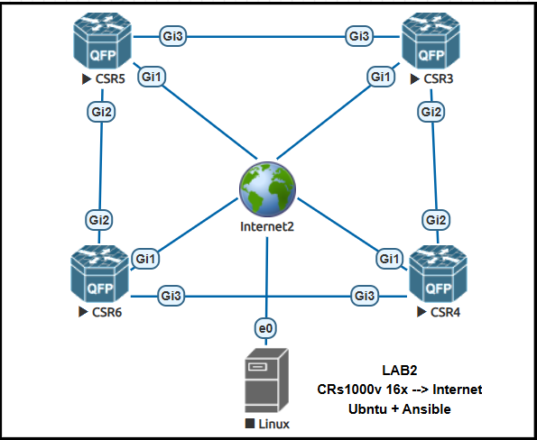

# Automating networks with Ansible
- Software development life cycle enviroments:
    - **Dev:**
        - Local computer usully used with a very minimalistic setup.
        - It is the enviroment where developers can run tests during the code development
        - Once the dev enviroment completes on module or all works, it pushes the code to test enviroment.
    - **Test:**
        - In test enviroment there is a lab with a topology the most closer to production enviroment.
        - Here we can count with a server where Ansible and some other services are running, routers and switches.
        - Emualting software can be used like: Eve-ng, Cisco Modeling Labs, GNS3, PnetLabs.
        - After testing is done, code is pushed to production.
    - **Prod:**
        - Real server where Ansible will be running.
        - Real network working
## Ansible Networking Modules
- Ansible network modules: [Link](https://docs.ansible.com/projects/ansible/2.9/modules/list_of_network_modules.html)
- All availbale Modules: [Link](https://docs.ansible.com/projects/ansible/2.9/modules/modules_by_category.html#module-index)
- Ansible `state` options:
    - *Merged*: Update the config lines that changes if it existis or create it if doesn't exists with the provided data.
    - *Replace*: Delete the previous config and add the new configuration 
    - *Overridden*: Delete all objects under the same context and configure the objects listed.
    - *Delete*: Remove specific configuration.

## Lab topology using eve-ng
### Preparation
- 4x CSR1000v version 17.03.05
- Internet connection
- Linux server 



- Add initial configuration to enable ssh and netconf access:
```sh
#R3
#Check ip and port status
ena
show ip interface brief
#Configure hostname
conf t
hostname CSR3
#Configure ssh access
ip domain name crdevnet.com
crypto key generate rsa modulus 2048
line vty 0 4
login local
transport input ssh
exit
#Configuring user/password
username admin priv 15 secret password
do sh run | include http
#Configure NETCONF and RESCONF
netconf-yang
restconf
exit

#R4
#Check ip and port status
ena
show ip interface brief
#Configure hostname
conf t
hostname CSR4
#Configure ssh access
ip domain name crdevnet.com
crypto key generate rsa modulus 2048
line vty 0 4
login local
transport input ssh
exit
#Configuring user/password
username admin priv 15 secret password
do sh run | include http
#Configure NETCONF and RESCONF
netconf-yang
restconf
exit

#R5
#Check ip and port status
ena
show ip interface brief
#Configure hostname
conf t
hostname CSR5
#Configure ssh access
ip domain name crdevnet.com
crypto key generate rsa modulus 2048
line vty 0 4
login local
transport input ssh
exit
#Configuring user/password
username admin priv 15 secret password
do sh run | include http
#Configure NETCONF and RESCONF
netconf-yang
restconf
exit

#R6
#Check ip and port status
ena
show ip interface brief
#Configure hostname
conf t
hostname CSR6
#Configure ssh access
ip domain name crdevnet.com
crypto key generate rsa modulus 2048
line vty 0 4
login local
transport input ssh
exit
#Configuring user/password
username admin priv 15 secret password
do sh run | include http
#Configure NETCONF and RESCONF
netconf-yang
restconf
exit
```
- Install ansible by using pip:
```sh
mkdir ansible
cd ansible
python3 -m venv ansible-lab
source ansible-lab/bin/activate
python3 -m pip install --user ansible
python3 -m pip install --user ansible-core
```
### Inventory
- Optional, if we want to run acual CLI command we can use the option: `network_cli`. It can parse the output.
- In local folder create inventory directory and file:
```yaml
all:
  childen:
    ios_xe_routers:
      hosts:
        ios-xe-3:
          ansible_host: 192.168.160.133
          ansible_user: admin
          ansible_password: password
          ansible_network_os: iosxe
          ansible_connection: netconf
        ios-xe-4:
          ansible_host: 192.168.160.130
          ansible_user: admin
          ansible_password: password
          ansible_network_os: iosxe
          ansible_connection: netconf
        ios-xe-5:
          ansible_host: 192.168.160.131
          ansible_user: admin
          ansible_password: password
          ansible_network_os: iosxe
          ansible_connection: netconf
        ios-xe-6:
          ansible_host: 192.168.160.139
          ansible_user: admin
          ansible_password: password
          ansible_network_os: iosxe
          ansible_connection: netconf

```
- Test ansible server connection against all nodes:
```sh
#Execut ping to remote end
ansible -i inventory/inventory.yaml ios_xe_routers  -m ping
(ansible-lab) devnet@devnet-VirtualBox:/Lab01$ ansible -i inventory/inventory.yaml ios_xe_routers  -m ping
ios-xe-3 | SUCCESS => {
    "changed": false,
    "ping": "pong"
}
ios-xe-5 | SUCCESS => {
    "changed": false,
    "ping": "pong"
}
ios-xe-6 | SUCCESS => {
    "changed": false,
    "ping": "pong"
}
ios-xe-4 | SUCCESS => {
    "changed": false,
    "ping": "pong"
}

# Gather all facts from remote devices
ansible -i inventory/inventory.yaml ios_xe_routers  -m ansible.builtin.setup
```
### Playbook to gather all facts
- For Cisco there are custom facts module located at: `cisco.ios.ios_facts`
- Use this enviroment variable to avoid issues ssh unknow hosts: `export ANSIBLE_HOST_KEY_CHECKING=False`.
- Comment `connection_type` key in all hosts from inventory. This is because `connection: ansible.netcommon.network_cli` uses ssh by default.
- Create plabook:
```yaml
---
- name: Gather and display facts from network devices
  hosts: ios_xe_routers
  gather_facts: false
  connection: ansible.netcommon.network_cli

  tasks:
    - name: Gather all facts from the network devices
      connection: ansible.netcommon.network_cli
      cisco.ios.ios_facts:
        gather_subset: all
      register: ios_xe_facts
    - name: Display the gathered facts
      debug:
        var: ios_xe_facts
    - name: Save the gathered facts to a file
      copy:
        content: "{{ ios_xe_facts | to_nice_json }}"
        dest: "ios_xe_facts_{{ inventory_hostname }}.json"
```
- Execute the playbook:
```sh
export ANSIBLE_HOST_KEY_CHECKING=False
ansible-playbook -i inventory/inventory.yaml gatherfacts.yaml

#In case of troubleshooting:
ansible-playbook -i inventory/inventory.yaml gatherfacts.yaml -vvv
```
### Create loopback address with cli mode
- Create `host_vars` folder add loopback information:
```yaml
loopback0:
  ip: 30.30.30.30
  mask: 32
  description: Router3 Loopback0 Interface
loopback_ip_list:
  - name: Loopback1
    ipv4:
      - address: 31.31.31.31/32
  - name: Loopback2
    ipv4:
      - address: 32.32.32.32/32
  - name: Loopback3
    ipv4:
      - address: 33.33.33.33/32
loopback_description_list:
  - name: Loopback1
    description: Router3 Loopback1 Interface
    enabled: true
  - name: Loopback2
    description: Router3 Loopback2 Interface
    enabled: true
  - name: Loopback3
    description: Router3 Loopback3 Interface
    enabled: true
```
- Create the playbook
```yaml
---
- name: Configure Loopback Interfaces
  hosts: ios_xe_routers
  gather_facts: false
  connection: ansible.netcommon.network_cli

  tasks:
    - name: Gather Interface information as structured data
      cisco.ios.ios_facts:
        gather_network_resources: l3_interfaces
      register: interfaces_pre
    - name: Display PRE Interface information
      debug:
        var: interfaces_pre.ansible_facts.ansible_network_resources
        
    - name: Configure Loopback0 interfaces on the network devices
      cisco.ios.ios_interfaces:
        config:
          - name: Loopback0
            description: "{{ loopback0.description }}"
            enabled: true
        state: merged
    - name: Configure Loopback0 IP address on the network devices
      cisco.ios.ios_l3_interfaces:
        config:
          - name: Loopback0
            ipv4:
              - address: "{{ loopback0.ip }}/{{ loopback0.mask }}"
        state: merged

    - name: Configure multiple Loopbacks descriptions
      cisco.ios.ios_interfaces:
        config: "{{ loopback_description_list }}"
        state: merged
    - name: Configure multiple Loopbacks IPs
      cisco.ios.ios_l3_interfaces:
        config: "{{ loopback_ip_list }}"
        state: merged

    - name: Gather Interface information as structured data
      cisco.ios.ios_facts:
        gather_network_resources: l3_interfaces
      register: interfaces_post
    - name: Display POST Interface information
      debug:
        var: interfaces_post.ansible_facts.ansible_network_resources
```
- Executure ansible playbook 
```sh
#In the Node run
ena
sh ip int brief
#Run the plyabook
export ANSIBLE_HOST_KEY_CHECKING=False
ansible-playbook -i inventory/inventory.yaml create_loopbacks.yaml
#then check the changes
sh ip int brief
```
### Configure OSPF with Ansible
- In this section