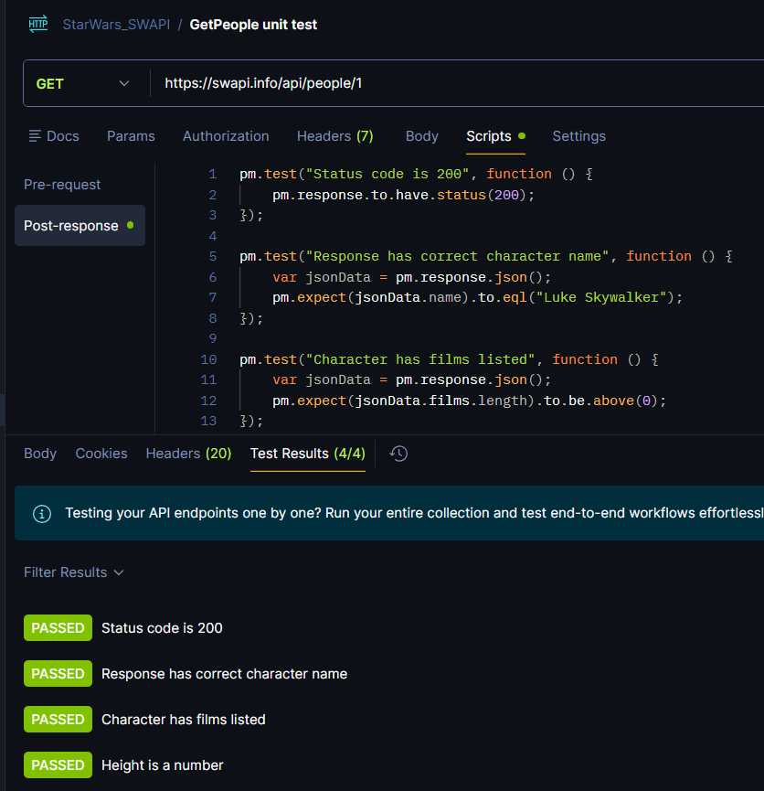

# APP testing
This is the way how the written code can be proved and make sure it is working, before pushing it to production.
## APP testing types
There are 4 core tests:
- *Unit Test*: Write code to test the developed code and make sure it works as it expected to do. Here functions, classes, methods are tested.
- *Integration Test*: it checks possible issues at the moment this new code is integrated to production.
- *System Test*: It makes sure the app still working from front to back after the new change is introduced in prod code.
- *User acceptance testing (UAT)*: Use of stakeholders, customers, business part test the app and make sure it is working.

**Note**: Unit test, integration tests, system tests can be automated by using `CID/CD`. This is part of DevOps role. 

```sh
    +--------------CI/CD---------------------+
    |                   |                    | 
+-----------+    +----------------+     +-----------+     +-----------------------------+
| Unit Test |--->|Integration Test|---->|System Test|---->|User acceptance testing (UAT)|
+-----------+    +----------------+     +-----------+     +-----------------------------+
```

## Unit Test using python
**Best practices:**
- Prepend at the beginning the word *test_* then *filename* of the code file be tested.
- Import the function to be tested in your unit test script.
- Create a base class with core functionality.
- Inside the class, the methods names must start with `tes_` prefix.
- To options to have visual report:
```sh
# To have visual report in HTML format
pip install html-reporter 
# To have visual report in XML format (used in CID/CD)
pip install unittest-xml-reporting
```

**Script:**
```py
def add_numbers(a: int, b: int) -> int:
    if not isinstance(a, int) or not isinstance(b, int):
        raise TypeError("Both arguments must be integers")
    return a + b

if __name__ == "__main__":
    print(add_numbers(1, 2))
```

**Unittest:**
```py
#test_mathy.py
import os
import unittest
from mathy import add_numbers
from html_reporter import HTMLTestRunner  # Import the HTML runner
import xmlrunner  # Import the XML runner

class TestAddNumbers(unittest.TestCase):
    
    def test_add_positive_numbers(self):
        self.assertEqual(add_numbers(3, 4), 7, "Should be 7 when adding 3 and 4")
    
    def test_add_negative_numbers(self):
        self.assertEqual(add_numbers(-3, -4), -7, "Should be -7 when adding -3 and -4")
    
    def test_add_mixed_numbers(self):
        self.assertEqual(add_numbers(3, -4), -1, "Should be -1 when adding 3 and -4")

    def test_add_zero(self):
        self.assertEqual(add_numbers(0, 5), 5, "Should be 5 when adding 0 and 5")
        self.assertEqual(add_numbers(5, 0), 5, "Should be 5 when adding 5 and 0")

    def test_add_strings(self):
        with self.assertRaises(TypeError):
            add_numbers("3", "4")

if __name__ == "__main__":
    os.current_dir = os.path.dirname(os.path.abspath(__file__))
    # print(f"Current directory: {os.current_dir}")
    output_dir = os.path.join(os.current_dir, 'test-reports')
    os.makedirs(output_dir, exist_ok=True)
       
    # Simple test runner
    unittest.main()


    # # Swap out the default runner for the HTML reporter
    # runner = HTMLTestRunner(
    #     report_filepath=os.path.join(output_dir, "test_report.html"),
    #     title="Application Unit Tests",
    #     description="Automated build verification report."
    # )
    # unittest.main(testRunner=runner)

    # # Results will be saved as XML inside the 'test-reports' directory
    # unittest.main(testRunner=xmlrunner.XMLTestRunner(output=output_dir))


```

**Execution:**
```sh
cd AppTesting/UnitTest1
python test_mathy.py

#Output:
.....
----------------------------------------------------------------------
Ran 5 tests in 0.003s

OK
```

## Assertion types
- Unittest library is coming with a set of assertions which helps the developers to create easier checks.
- Types: https://docs.python.org/es/3.9/library/unittest.html#assert-methods

**Execution:**
```sh
cd AppTesting/UnitTest2
python areaCalculator.py
python test_areaCalculator.py
```
**Another example:**
```sh
cd AppTesting/UnitTest6
python calculateDivision.py
python -m pytest test_calculateDivision.py --html=test-report/report.html --junitxml=test-report/report.xml --cov=test_calculateDivision --cov-report=html
```

## Unit test for fastAPI
- `FastAPI` uses by default `pytest` framework to run unit tests.
- It uses `pytest` framework to build unit tests functions.
- To install `pytest` run : `pip install pytest`
- To execute the test:
```sh
#Run API 
cd AppTesting/UnitTest3/app
uvicorn.exe main:app --reload

#In another terminal run pytest
python -m pytest test_app.py -v
```

## Network Testing Automation
- With unit test we DON'T want to touch any actual device (router, switch, server running application, PROD API).
- For API unit test, it used a "mock API" to run all testing.
- For CLI parsing and config generation, we can create a unit test to create the command and see the results.
- For SSH connections we can create a unit test which test the features needed for the connection.
- For more detailed test install:
```sh
pip install pytest pytest-html pytest-cov unittest-xml-reporting
```
- Then run the script:
```sh
cd AppTesting/UnitTest4
python -m pytest test_configGenrator.py -v --html=test-report/report.html --junitxml=test-report/report.xml --cov=generate_interface_config --cov-report=html

#See results from CLI and web at "test-report" folder
```

## Postman test

- Test can be executed before API call and post execution.
- Pre execution can be used to test the payload inside a request.
- Postman JS uses the testing library call `chai`. [Link](https://www.chaijs.com/)
- Test results will be seen at "Test Result" section.
**Unit Test:**
```js
pm.test("Status code is 200", function () {
    pm.response.to.have.status(200);
});

pm.test("Response has correct character name", function () {
    var jsonData = pm.response.json();
    pm.expect(jsonData.name).to.eql("Luke Skywalker");
});

pm.test("Character has films listed", function () {
    var jsonData = pm.response.json();
    pm.expect(jsonData.films.length).to.be.above(0);
});

pm.test("Height is a number", function () {
    var jsonData = pm.response.json();
    pm.expect(parseInt(jsonData.height)).to.be.a("number");
});
```
**Execution Result:**



