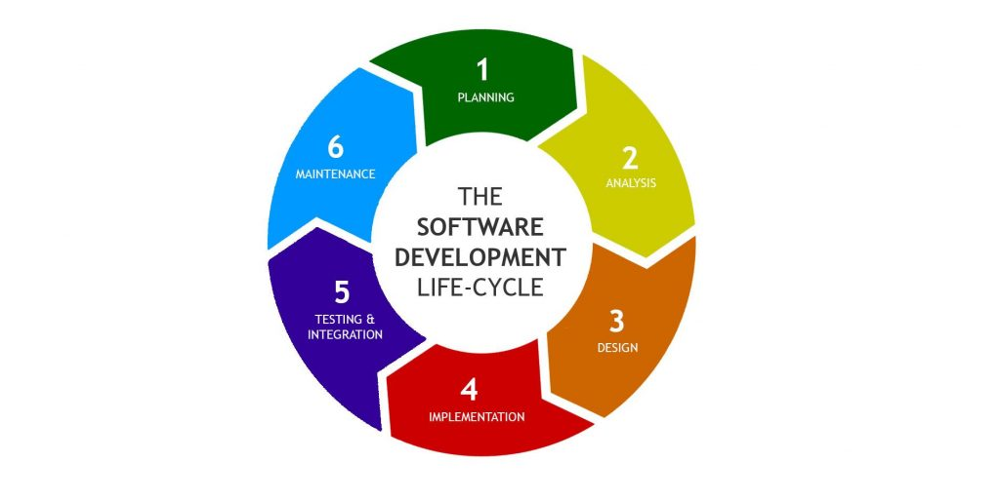
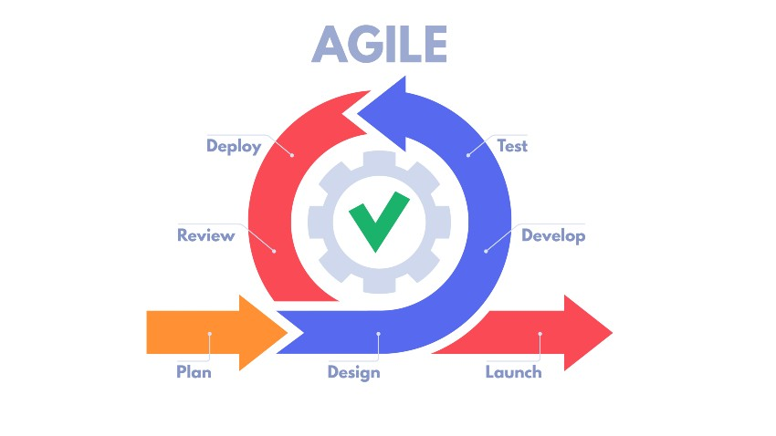
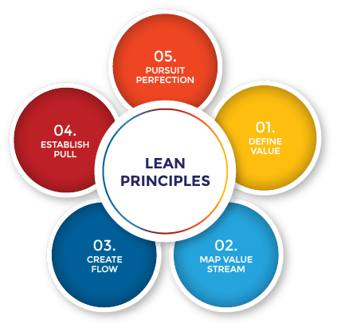
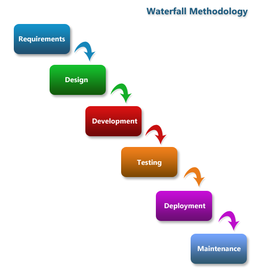

# DevOps Principles
- **DEVOPS** is the combination of *Software development* and *Business Operations* (Systems and Network)
- *Devops* also makes operations that facilitate software development.
- *Devops* manages how software can be developed, tested and delivered. 
## The SDLC (Software Development Lifecycle) 
- It is broken down into faces and close loop cycle:
    1. PLAN: Problem to solve or new idea, and Create a plan.
    2. Build: (Write code)
    3. CI/CD: (Continuous Integration/ Continuos delivery) | pipeline
    4. Monitor: and use.
    5. Feedback 

## OODA Loop
- **OODA** is used to measure and improve the devops SDLC:
    - **Observe** what can be improved into the environment and collect information.
    - **Orient** and create priorities. 
    - **Decide** action plans.
    - **Action** execute the plan.
## Test-driven deployment (TDD)
- Goals are achieved through coding requirements.
- Initiated by bugs or feature requests.
- Creates a library of code tests (Unit Test).
    - Testing is driven against small sections code and functions.
    - Smallest part of software that can be tested.
    - Make sure it is simple and focused testing tasks.
### TDD Steps
1. Write a unit test.
2. Unit test fails cases.
3. Write code to pass the test.
4. Unit testing passes.
5. Refactoring (Fixing issues) 
## Agile Method
### Agile Principles
- Individuals and interactions are values over process and faults.
- Working software over comprehensive documentations.
- Customer collaboration over contract negotiation.
- Response to change over pre-determined plans.
### Benefits
- Minimize the risks for developing or updating the software.
- Risks = Budget overages, bugs, etc.
- Incremental software interactions released over the time.
- Ongoing interactions informed by customer feedback.
- Popular base framework for many other methods.
### Agile cycle
#### 1. Product backlog
- Changes are created by feedback and review based on customer feedback.
- Backlog:
    - Everything we can be possible to think, the product can potentially include, or it needs to be accomplished. 
#### 2. Sprint Planning
- Priorities must be set in order.
- **Sprint**: Individual development cycle
    - Average duration 4 weeks.
- Adds incremental changes.
#### 3. Sprint Cycles.
- Daily scrum (daily meetings)
    - Team openly discuss failures, successes, work already completed and plans for daily work that is on going.
    - Meetings with no larger than 10 people.
#### 4. Working version
- First working version can be deployed.
- Given to customers for review and feedback.
#### 5. Customer feedback
- More work to do based on customer feedback or any other feature,
- This feedback goes to product backlog.
### Summary
- It is a methodology that help to have a better SDLC. 
- Sprint (longest 3 weeks)
- Feedback checks:
    - Quantitive:
        - % Speed increase.
        - Price change
    - Quality:
        - Customer satisfaction.
    - Measuring criterial:
        - Good Results and keep improving.
        - Bad results and fail fast.
        - No change at all.

## Lean Method
- Basics for *Agile* methodology.
- This is not a modern software deployment framework.
### Considerations
- Elimination of waste.
    - Waste: Something that doesn't add any value to customer product.
- Just-in-time:
    - Do not create anything until customer is ready to buy it.
- Continuous improvements (Kaizen)
### Lean Steps
#### 1. Identify a value
- This value is measured in terms of end customer.
#### 2. Map the value stream
- Create a workflow with the necessary steps for adding this value to the product/service.
#### 3. Create flow
- Identify tools and steps to implement it more efficiently.
#### 4. Establish pull
- Customer pull values as needed, it should be available when they need it.
#### 5. Seek perfection
- Loop constantly for improvements and increase the efficiency.

## Waterfall Method
- More rigid approach to development.
- Goes to only one direction.
- Each phase must be completed before moving on.
- The shortcomings to this rigid approach with modern deployment.
### Challenges
- Everything is planed at the beginning of the project.
- No value is created until the end of process.
- Quality will be a challenge.
### Phases
#### 1. Requirements gathering
- Require documentation with all details needed for the product/service.
#### 2. System design
- Align requirements and specifications with the hardware and software required.
#### 3. Coding
- Write the code based on the needs.
#### 4. Testing
- As we can't go back, the code must be recreated and add the fix to correct it.
#### 5. Deployment
- Once everything seems to be working, deploy it on production.
#### 6. Maintenance
- Develop parches/patches for bugs/issues after the installation.

## CI/CD pipelines
### CI Continuos Integration
- Git Repo:
    - Git repo is created
    - Git repo is cloned in a local machine
    - Create a new branch to start the work
    - Once all work is done, code is pushed and create a PR (Pull Request) to merge it.
- Build and compile the created SW/Script (**Jenkins** is usually used for this testing)
    - Spine up a new environment where the new code can be merged, build and compiled.
    - After the test if all goes well, code is ready for CD step.
### CD Continuos Delivery
- It uses IaC (Infrastructure as code) to deploy the new code in another environments like: Dev, Test or Prod.
- Almost always it is used Ansible or Terraform to do this part of the job.
- CD makes sure the environment is ready for this code and push the code in the environment.
- Jenkins also is use for code deployment in these environments too.
## Git (Source Control) and IaC
- Source control: Github, GitLab, Jenkins.
- Options:
    - Jenkins can be connected to Github to trigger the pipeline execution.
    - Github -> Starts the pipeline -> Azure DevOps 

## References
- https://www.cflowapps.com/agile-workflow/
- https://theleanway.net/The-Five-Principles-of-Lean
- https://castellansystems.com/kb/Waterfall.cshtml