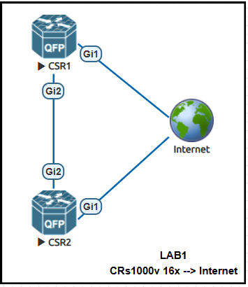

# Atomating with Cisco IOS-XE

## YANG and Netconf with IOS-XE
Pre-requisites:
1. eve-ng hosted locally or on cloud.
2. CRs1000v with IOS-EX 16.x or newer. [eve-ng images link](https://github.com/hegdepavankumar/Cisco-Images-for-GNS3-and-EVE-NG?tab=readme-ov-file)
3. Internet or local ssh connection 

<b>Notes:</b> 
- Link of supported HW for IOS-XE [link](https://www.cisco.com/site/us/en/products/networking/cloud-networking/ios-xe/index.html)
- Optionally if there is not access to eve-ng, use cisco sandbox.



### YANG Model
YANG models defines how the data should be structured to be able to interact with some specific vendor equipment, it is ussually created by the vendor itself.
Link to all official available models: https://www.netconfcentral.org/

Those YANG modules convert the commands outputs in XML or JSON which is more friendly for the application to process it. There are standards ruled by IEEE and IETF which dictate the basicis for verdor's YANG models should be created and worked to make it easy to parse it in a multiverndor network.

### NETCONF Protocol
- Protocol used to interact with network elements in similar way as SSH does.
- `TCP` based protocol, by default it uses the port `830`
- It runs on top of `SSH` (it means, netconf behavies same as SSH protocol exchanging keys)
- It uses `RPC` (Remote Procedure Calls) to interact with the NEs.
- When the connection is establised, the NE will reply with the list of capabilities (List of supported YANG models).
- When an `RPC` is send, the origin adds on the header a message-id with a ramdom value. Once it is received and the NE replies to it, it uses the same message-id.

#### RPC (Remote Procedure Calls)
- It is a built in command to get or push data by using YANG model.
- Type of c:
    - `get`: Get operational state information
    - `get-config`: Get configuration
    - `set-config`: Push confguration

```xml
<rpc>
    <get>
        <data>
            #|---> YANG DATA FORMAT!!
        </data>
    </get>
</rpc>
```
### Pyang (Python library for YANG models)
1. Go to netconf folder: `cd IOX-XE/netconf`
2. Clone the git repo: `git clone https://github.com/YangModels/yang.git`
3. Create your own venv if it wasn't created already and make it active.
4. Install pyyang: `pip install pyang`
5. Go to vendor folder: `cd yang\vendor\cisco\xe`
6. Go to the user software version folder. i.e.: `ll xe/1731/` check all listed yang models
7. To view the model: `pyang.exe -f tree Cisco-IOS-XE-interfaces-oper.yang`

<b>Optional:</b> We can use yangsuit to check the Cisco YANG models: https://developer.cisco.com/docs/yangsuite/


### CSR1 configuration
Command list:
```bash
#Check ip and port status
ena
show ip interface brief

#Configure hostname
conf t
hostname CSR1

#Configure ssh access
ip domain name crdevnet.com
crypto key gen rsa mode 2048
line vty 0 4
login local
transport input ssh
exit

#Configuring use/passowrd
username admin priv 15 secret password

#Configure NETCONF
netconf-yang
```
### CSR2 configuration
Command list:
```bash
#Check ip and port status
ena
show ip interface brief

#Configure hostname
conf t
hostname CSR2

#Configure ssh access
ip domain name crdevnet.com
crypto key gen rsa mod 2048
line vty 0 4
login local
transport input ssh
exit

#Configuring use/passowrd
username admin priv 15 secret password

#Configure NETCONF
netconf-yang
```

### Collecting data with NETCONF
Execute python  script to collect interface information from the remote node:
1. Connect via CLI to CSR1 and CSR2, collect management IP (In this case is the DCHP IP running on port Gi0/0).
2. Open the python script at `IOS-XE\netconf\connec.py` replace the IP and credentials acordingly.
```py
DEVICE = {
        "host": "192.168.160.134",  # TODO: change to your device IP / hostname
        "username": "admin",   # TODO: change to your username
        "password": "password",   # TODO: change to your password
        "port": 830,
    }
```
3. Install libraries: `pip install ncclient xmltodict`
4. Execute the script: `Python IOS-XE\netconf\connec.py`. The output will look like this:
```bash
Interface           IP-Address        OK?   Method  Status      Protocol
--------------------------------------------------------------------------
GigabitEthernet1    unassigned        YES           if-oper-state-readyif-state-up
GigabitEthernet2    unassigned        YES           if-oper-state-no-passif-state-down
GigabitEthernet3    unassigned        YES           if-oper-state-no-passif-state-down
GigabitEthernet4    unassigned        YES           if-oper-state-no-passif-state-down
(venv)
```

### Push data with NETCONF onto remote node
Execute python script to provision 2 loopbacks IPs in 2 diffenten interfaces in the remote node:
1. For security best practices, we need to avoid the utilization of credentials, IPs inside of script code. To avoid it, we can use enviroment variables in linux and windows.

Linux
```bash
export NETCONF_HOST="x.x.x.x"
export NETCONF_USER="admin"
export NETCONF_PASS="password"
python .\IOS-XE\netconf\setloop.py
```
Powershell
```powershell
$env:NETCONF_HOST="x.x.x.x"
$env:NETCONF_USER="admin"
$env:NETCONF_PASS="password"
python .\IOS-XE\netconf\setloop.py
```
2. Execute the script: `Python IOS-XE\netconf\setloop.py`. The output will look like this:
```bash
#EXECUTION LOG
Loopback1 -> 10.10.10.2/255.255.255.255
Loopback2 -> 10.10.10.1/255.255.255.255
<?xml version="1.0" encoding="UTF-8"?>
<rpc-reply xmlns="urn:ietf:params:xml:ns:netconf:base:1.0" message-id="urn:uuid:dc376de6-2b84-4035-8da8-2b4d14bd3069" xmlns:nc="urn:ietf:params:xml:ns:netconf:base:1.0"><ok/></rpc-reply>
<?xml version="1.0" encoding="UTF-8"?>
<rpc-reply xmlns="urn:ietf:params:xml:ns:netconf:base:1.0" message-id="urn:uuid:66f0a3fb-5842-4029-9028-801e8457881d" xmlns:nc="urn:ietf:params:xml:ns:netconf:base:1.0"><data><native xmlns="http://cisco.com/ns/yang/Cisco-IOS-XE-native"><interface><Loopback><name>1</name><ip><address><primary><address>10.10.10.2</address><mask>255.255.255.255</mask></primary></address></ip><logging><event><link-status/></event></logging></Loopback><Loopback><name>2</name><ip><address><primary><address>10.10.10.1</address><mask>255.255.255.255</mask></primary></address></ip><logging><event><link-status/></event></logging></Loopback></interface></native></data></rpc-reply>
(venv) 
```
CLI info:
```
CSR1#show ip int brief
Interface              IP-Address      OK? Method Status                Protocol
GigabitEthernet1       192.168.160.134 YES DHCP   up                    up
GigabitEthernet2       unassigned      YES NVRAM  administratively down down
GigabitEthernet3       unassigned      YES NVRAM  administratively down down
GigabitEthernet4       unassigned      YES NVRAM  administratively down down
Loopback1              10.10.10.2      YES other  up                    up
Loopback2              10.10.10.1      YES other  up                    up
CSR1#
```
<Notes:>
- IOS-XE 3 types of config were we can do changes:
    - `Startup` config: Configuration used for the booting process
    - `Running` config: Current live configuration
    - `Candidate` config: We can introduce changes and then `commit` them to make it active

## YANG and Resconf with IOS-XE
### RESCONF Protocol
Diffentences:
<table>
    <tr>
        <th>NETCONF</th>
        <th>RESTCONF</th>
    </tr>
    <tr>
        <td><code>SSH --> TCP port 830</code></td>
        <td><code>HTTP/S --> TCP port 80/443/custom port</code></td>
    </tr>
    <tr>
        <td>XML only</td>
        <td>XML/JSON<br>
        <code>Headers -> Content-type (XML/JSON)<br>
              Headers -> Accept (XML/JSON) used to determent which type we will accept.</code></td>
    </tr>
    <tr>
        <td>Release versions years: 2006, 2011</td>
        <td>Release versions years: 2017, 2019</td>
    </tr>
    <tr>
        <td>It uses <code>RPC</code>: <code>get</code>, <code>get-config</code>, <code>set-config</code></td>
        <td>It uses <code>REST</code>: <code>GET</code>, <code>PATCH</code>, <code>POST</code>, <code>DELETE</code> Same as APIs</td>
    </tr>
</table>

### RESCONF Configuration

Configuration of NETCONF/RESCONF using AAA:
```sh
#For AAA only!!
enable
configure terminal
aaa new-model
aaa group server radius server-name
server-private ip-address key key-name
ip vrf forwarding vrf-name
exit
aaa authentication login default group group-name local
aaa authentication login list-name none
aaa authorization exec default group group-name local
aaa session-id common
line console number
login authentication authentication-list
end
```
1. Usually `resconf` comes with partial configuration done and it can be verifed like the command below:
```bash
CSR2#sh run | include http
ip http server
ip http authentication local
ip http secure-server
ip http client source-interface GigabitEthernet1
  destination transport-method http
```
2. To turn up the `resconf`:
```bash
enable
conf t
restconf
```
After it, the node will sincrhonize internally and loading all configs (startup, running, candidate) into a HTTP database.

3. Verificaation commands:
```sh
show platform software yang-management process monitor
show platform software yang-management process
show netconf-yang sessions
show netconf-yang sessions detail
```

### Connecting to CSR2 via RESCONF using Postman
#### Getting node capabilities
List all YANG models supported by the SW version can be checked and compared with the yang model downladed in prevous sections.
1. Create new collection and name it.
2. Create an new evniroments and add in it variables with respective values for:
    - username=Admin
    - password (encrypted) = password
    - CSR2IP = `<your IP>`
2. Inside of previusly created collection create a get request and name it `getCapabilities` with the following information:
    - Type of request : `GET`
    - URL: 
        - `https://{{CSR2IP}}/restconf/data/netconf-state/capabilities` --> full netconf capabilities and yang-data-model
        - `https://{{CSR2IP}}/restconf/data/ietf-restconf-monitoring:restconf-state/capabilities` --> All capabilities supported by resconf
    - Headers: 
        - `Content-type : application/yang-data+json` 
        - `Accept : application/yang-data+json`.
        -  With this configuration we are indicating the remote NE we are sending/receving the information in json format.
    - Authorization:
        - Auth type: Basic Auth
            - user=`{{username}}`
            - password=`{{password}}`

#### Getting node interfaces information
1. Inside of previusly created collection create a get request and name it `getCapabilities` with the following information:
    - Type of request : `GET`
    - URL: 
        - `https://{{CSR2IP}}/restconf/data/Cisco-IOS-XE-interfaces-oper:interfaces/interface` --> to get all interfaces status.
        - `https://{{CSR2IP}}/restconf/data/Cisco-IOS-XE-interfaces-oper:interfaces/interface=GigabitEthernet1` --> to get all details from GigabitEthernet1 interface.
        - `https://{{CSR2IP}}/restconf/data/Cisco-IOS-XE-interfaces-oper:interfaces/interface?fields=admin-status` --> to get `admin-status` in all interfaces.
        - `https://{{CSR2IP}}/restconf/data/ietf-interfaces:interfaces` --> ietf interface data model (short version)
    - Headers: 
        - `Content-type : application/yang-data+json` 
        - `Accept : application/yang-data+json`.
        -  With this configuration we are indicating the remote NE we are sending/receving the information in json format.
    - Authorization:
        - Auth type: Basic Auth
            - user=`{{username}}`
            - password=`{{password}}`

#### Create a new loopback in node
1. Inside of previusly created collection create a get request and name it `createLoopback` with the following information:
    - Type of request : `POST`
    - URL: `https://{{CSR2IP}}/restconf/data/ietf-interfaces:interfaces`
    - Headers: 
        - `Content-type : application/yang-data+json` 
        - `Accept : application/yang-data+json`.
        -  With this configuration we are indicating the remote NE we are sending/receving the information in json format.
    - Authorization:
        - Auth type: Basic Auth
            - user=`{{username}}`
            - password=`{{password}}`
    - Body:
        - JSON format: 
```json
{
    "ietf-interfaces:interface": {
        "name": "Loopback102",
        "type": "iana-if-type:softwareLoopback",
        "enabled": true,
        "ietf-ip:ipv4": {
            "address":[
                {
                    "ip": "102.102.102.102",
                    "netmask": "255.255.255.255"
                }
            ]
        }
    }
}
```
#### Edit a loopback in node
1. Inside of previusly created collection create a get request and name it `createLoopback` with the following information:
    - Type of request : `PUT`
    - URL: `https://{{CSR2IP}}/restconf/data/ietf-interfaces:interfaces/interface=Loopback102`
    - Headers: 
        - `Content-type : application/yang-data+json` 
        - `Accept : application/yang-data+json`.
        -  With this configuration we are indicating the remote NE we are sending/receving the information in json format.
    - Authorization:
        - Auth type: Basic Auth
            - user=`{{username}}`
            - password=`{{password}}`
    - Body:
        - JSON format: 
```json
{
    "ietf-interfaces:interface": {
        "name": "Loopback102",
        "type": "iana-if-type:softwareLoopback",
        "enabled": true,
        "description": "Set via postman", --> NEW value
        "ietf-ip:ipv4": {
            "address":[
                {
                    "ip": "102.102.102.102",
                    "netmask": "255.255.255.255"
                }
            ]
        }
    }
}
```