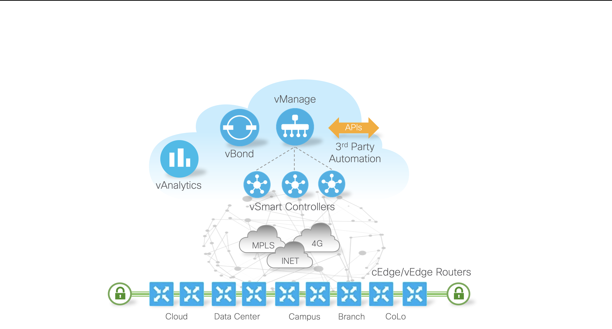

# Cisco SD-WAN (Viptela)
- Sowftware define WAN
- Router CE is configured so when it booted it will automatically try to connect to Controller located in a DC and pull its config.
    - Config includes:
        - IP addresses (LAN/WAN)
        - IPSec Tunnels
        - Application - Aware Routing
        - QoS
- Branch to branch communication.
- Important topics:
    - Jitter
    - QoS
    - Latency
    - Security (VPN)
- Uses:
    - WAN interconnection
    - Voice/Collaboration
    - DB replication
## SD-WAN components
- <b>vManage:</b> Northbound API/GUI and it is the brain of the operation
    - Desing Policies templates to be pushed onto Edgege devices configurations.
- <b>vSmart:</b> Executes changes ordered by others elements.
- <b>vBond:</b> This is the DMZ where unconfigured devices can reach via ztp it and be able to authenticate each other. Then vBond orchestate with the VSmart Controllers to send the config back to the node.
    - Use:
        - Provisioning
        - Onboarding
- <b>vAnalytics:</b> Collects stats and print them to see all network resouces health and additioanl information like live traffic, etc.
- <b>WAN Edges:</b> ZTP is used to provision the device/appliance/VM automatically when it is booted.
    - <b>cEdges:</b> Cisco Catalyst edge appliance
    - <b>vEdges:</b> Viptela appliance
    - Examples:
        - Cloud
        - Data Center
        - Campus
        - Branch
        - CoLo
- [SD-WAN (20.10) API documentation link](https://developer.cisco.com/docs/sdwan/20-10/)

## SD-WAN API 
In this API manage different exclusive ways to pull data and push data on the system
### Authentication to collect data
- Create `POST` request
- URL: `https://{vmanage-ip-address}/j_security_check`
- Headers: `Content-Type: application/x-www-form-urlencoded`
- Body: `"j_username={admin}&j_password={credential}"`

If a user is successfully authenticated, the response body is empty and a valid session cookie is set is response `(set-cookie: JSESSIONID=)`.
If a user is un-authenticated, the response body contains a html login page with tag in it.
API client should check the response body for to identify whether the authentication is successful or not. This is the behavior of our application server.

### Authentication to push data and session destroy
- Collecting XSRF-Token:
    - Create `POST` request
    - URL: `https://{vmanage-ip-address}/dataservice/client/token`
    - Headers: 
        - `Content-Type: application/json`
        - `Cookie: JESSIONID={session hash id}`
- Making a post request:
     - Create `POST` request
    - URL: `https://{vmanage-ip-address}/dataservice/{api-endpoint-url}`
    - Headers: 
        - `Content-Type: application/json`
        - `Cookie: JESSIONID={session hash id}`
        - `X-XSRF-TOKEN: {XSRF token}`
- Destroying the session:
    - Create `POST` request
    - URL: `GET https://{vmanage-ip-address}/logout?nocache={random-number}`
    - Headers: 
        - `Cookie: JESSIONID={session hash id}`
- How to collect device inventory: [LINK](https://developer.cisco.com/docs/sdwan/20-10/device-inventory/#connect-devices)

#### Using postman collections from Cisco code exchange
- Links:
    - [Cisco code exchange SD-WAN](https://developer.cisco.com/codeexchange/github/repo/CiscoDevNet/Postman-for-Cisco-SD-WAN/)
    - [Postman collection](https://github.com/CiscoDevNet/Postman-for-Cisco-SD-WAN)
- Clonning git repo:
```
git clone https://github.com/CiscoDevNet/Postman-for-Cisco-SD-WAN
```
- Open postman and import collections.

## Python: list devices via vManage API
This repo includes a small script to authenticate to vManage and print the device inventory.

### Environment variables
- `VMANAGE_URL`: vManage base URL (example: `https://sandboxsdwan.cisco.com:8443`)
- `VMANAGE_USERNAME`: username
- `VMANAGE_PASSWORD`: password
- `SDWAN_VERIFY_SSL`: `true`/`false` (optional, default `true`)
- `SDWAN_TIMEOUT_S`: request timeout seconds (optional, default `30`)

### Run
From the `SD-WAN/` folder:
```
python sdwan_get_devices.py

#Expected output
HOSTNAME       SYSTEM_IP   SITE  TYPE     REACH      STATUS  VERSION        
-------------  ----------  ----  -------  ---------  ------  ---------------
vmanage        10.10.1.1   101   vmanage  reachable  normal  20.10.1        
vsmart         10.10.1.5   101   vsmart   reachable  normal  20.10.1        
vbond          10.10.1.3   101   vbond    reachable  normal  20.10.1        
dc-cedge01     10.10.1.11  100   vedge    reachable  normal  17.10.01.0.1479
site1-cedge01  10.10.1.13  1001  vedge    reachable  normal  17.10.01.0.1479
site2-cedge01  10.10.1.15  1002  vedge    reachable  normal  17.10.01.0.1479
site3-vedge01  10.10.1.17  1003  vedge    reachable  normal  20.10.1  
```