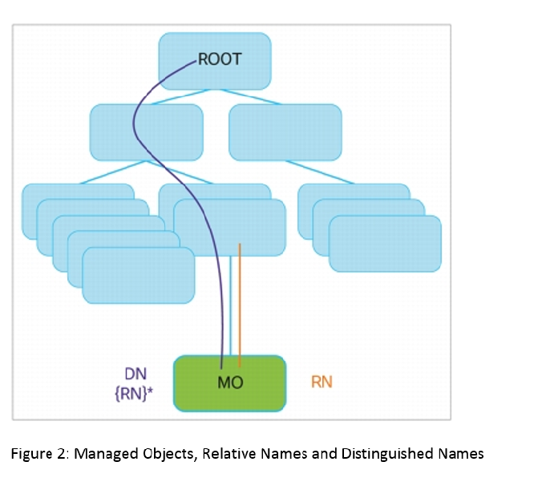
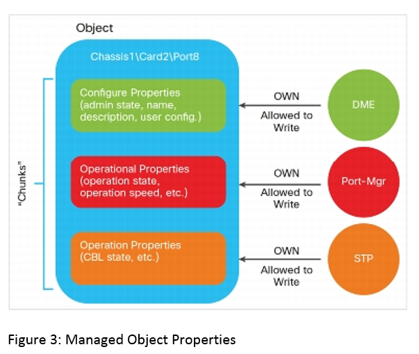

# Automation Nexus devices with NX-API
Notes:
- Nexus devices runs an OS called NX-OS which is a fork of a linux.
- NX-OS uses the `features` in the same way as `systemctl` in linux to enable/disable services.
- One service inside is NXAPI which we need to turn on:
    - CLI -> Sandbox
    - REST -> Visore -> web server in nginx

## How to configure an IP address for MGMT and enable NXAPI feature
1. We need to enable a feature:
```sh
conf t
#Enable interface vlan feature
feature interface-vlan
#Enable DHCP feature
feature dhcp
end
```
2. Configure dhcp
```sh
conf t
interface mgmt0
ip add dhcp
no shut
end
```
3. Verification
```sh
show ip int brief vrf management
```
4. Enable `NXAIP`
```sh
conf t
feature nxapi
end
#Optional! -> save this config in the startup config
copy run start
```
## NXAPI
This is a web service with 3 services:
- NXAPI-CLI
- NXAPI-REST (DME)
- RESCONF (YANG)

### NXAPI-CLI
- It sends request with the entered CLI command and retrieves the output in json format. 
- It can be 1 or more commands, all of them will be executed on CLI.
- Configuration commands can also be executed.
- It works with `JSON-RPC`, `XML`, `JSON` formats.
- To be cable to use it requires the URL have the `ins` endpoint at the end, like this: `https://10.10.20.40/ins`
Example:
1. Sending the command `show version`.
2. `JSON` Request should be like:
```json
[
  {
    "jsonrpc": "2.0",
    "method": "cli",
    "params": {
      "cmd": "show version",
      "version": 1
    },
    "id": 1
  }
]
```
3. Node respose:
```json
{
  "jsonrpc": "2.0",
  "result": {
    "body": {
      "header_str": "Cisco Nexus Operating System (NX-OS) Software\nTAC support: http://www.cisco.com/tac\nDocuments: http://www.cisco.com/en/US/products/ps9372/tsd_products_support_series_home.html\nCopyright (c) 2002-2020, Cisco Systems, Inc. All rights reserved.\nThe copyrights to certain works contained herein are owned by\nother third parties and are used and distributed under license.\nSome parts of this software are covered under the GNU Public\nLicense. A copy of the license is available at\nhttp://www.gnu.org/licenses/gpl.html.\n\nNexus 9000v is a demo version of the Nexus Operating System\n",
      "bios_ver_str": "",
      "kickstart_ver_str": "9.3(5)",
      "nxos_ver_str": "9.3(5)",
      "bios_cmpl_time": "",
      "kick_file_name": "bootflash:///nxos.9.3.5.bin",
      "nxos_file_name": "bootflash:///nxos.9.3.5.bin",
      "kick_cmpl_time": "7/20/2020 20:00:00",
      "nxos_cmpl_time": "7/20/2020 20:00:00",
      "kick_tmstmp": "07/20/2020 23:30:11",
      "nxos_tmstmp": "07/20/2020 23:30:11",
      "chassis_id": "Nexus9000 C9300v Chassis",
      "cpu_name": "Intel(R) Xeon(R) Gold 6148 CPU @ 2.40GHz",
      "memory": 8163456,
      "mem_type": "kB",
      "proc_board_id": "92I8ER456HS",
      "host_name": "n9k",
      "bootflash_size": 4287040,
      "kern_uptm_days": 0,
      "kern_uptm_hrs": 22,
      "kern_uptm_mins": 39,
      "kern_uptm_secs": 49,
      "rr_reason": "Unknown",
      "rr_sys_ver": "",
      "rr_service": "",
      "plugins": "Core Plugin, Ethernet Plugin",
      "manufacturer": "Cisco Systems, Inc.",
      "TABLE_package_list": {
        "ROW_package_list": {
          "package_id": "mtx-openconfig-all-1.0.0.0-9.3.5.lib32_n9000"
        }
      }
    }
  },
  "id": 1
}
```
4. Python script to collect `show version` data from remote node by use nxapi-cli:
```bash
python nexus_nx_api/nxapi-cli.py
```
### NXAPI-REST (DME)
- It is a REST API
- URL should begin with `<HTTP/HTTPS>://<HOST_IP/FQDN_DOMAIN>/sys`
- `sys` is an object and have models to structure the data.
- To know which objects and models there are available for the NX-OS we can check it on this URL: https://<HOST_IP>/visore.html
- Information is stored in herachical tree structure known as the management information tree (MIT).
- Each `MIT` represents a managed object or group of objects organized in herachical way.
- `NX-API-REST` uses information-model-based achitecture.
  - Managed Objects instances are refered as `MOs`.
  - Every managed object in the system is identified by a unique name `DN`.
  - Each object can be refered to by its relative name `RN`. It identifies an object relative to its parent object.
  - `Distnguished names` it are directly mapped to URLs same as `RN`
  - This API operates in forgiving mode, which means that missing attributes are substituted with default values (If applicable).
- Data management engine or `DME` validates and rejects incorrect attributes.




### RESCONF (YANG)
- It is a REST API which uses and requires YANG path to be added on the URL

### NXAPI-REST Postman using basic authentication
In this example we use NXAPI-CLI to get the output from the command: `show ip interface brief`
1. Configure enviroment variables.
  - NK9_IP = Host IP
  - NK9_USER = Username to login on N9k
  - NK9_PASSWORD = Password to login on N9k (enbale encryption for this entry)
2. Create a request:
  - Type: `POST`
  - URL: `https://{{NK9_IP}}/ins/`
  - Authentication: Select `Basic Authentication` and call the user and password variables in each field.
    - username = {{NK9_USER}}
    - password = {{NK9_PASSWORD}}
  - Body: set the data below and make sure option `raw` and `JSON` are enabled
```json
{
  "ins_api": {
    "version": "1.0",
    "type": "cli_show",
    "chunk": "0",
    "sid": "sid",
    "input": "show ip interface brief",
    "output_format": "json"
  }
}
```
### NXAPI-REST Postman using Token authentication.
To be able to use this option we need to do the following steps:
1. Get a valid Token from the target device:
  a. Send a `POST` request to endpoint `/api/aaaLogin.json` or `/api/aaaLogin.xml`  with valid credentials on the body.
  JSON format:
  ```json
  {
    "aaaUser" : {
      "attributes" : {
        "name" : "{{NK9_USER}}",
        "pwd" : "{{NK9_PASSWORD}}"
      }
    }
  }
  ```
  XML format:
  ```xml
  <aaaUser name="{{NK9_USER}}" pwd="{{NK9_PASSWORD}}"/>
  ```
  b. Use JavaScript script to parse the response body, collect the token ID and save it in variable inside of enviroment (In this case we should have a variable pre-configured in postman).
  Script to parse the json format:
```js
//Convering the resonse in js dictionary
var jsonData = pm.response.json();
//Reaching token data
var tk = jsonData.imdata[0].aaaLogin.attributes.token;
//Saving to information in "token" enviroment var
pm.environment.set("token",tk);
//Printing the information in console
console.log(tk)

```
  Script to parse the xml format:
```js
//Importing parseString function
const xml2js = require('xml2js').parseString;
//Converting the response in String format
var bodyAnsw = pm.response.text()
//Converting the XML data into a JS dictonary and saving it in a env var
xml2js(bodyAnsw, (err, data) => {
    if (err) throw err;
    var tk = data.imdata.aaaLogin[0].$.token
    pm.environment.set("token", tk)
    console.log(tk)
});
```  
2. Use the collected token in a new request in the next section.

### Using Visor API (NS-API-REST)
- To access it: https://<HOST_IP>/visore.html, Visor web page show information and helps to get right endpoint address for each query.
- It is required to have valid credentials to be able to login on the webportal.
- API documentation: https://www.cisco.com/c/en/us/td/docs/switches/datacenter/nexus9000/sw/7-x/programmability/guide/b_Cisco_Nexus_9000_Series_NX-OS_Programmability_Guide_7x/b_Cisco_Nexus_9000_Series_NX-OS_Programmability_Guide_7x_chapter_010001.html
- Tips:
  - `intf`-> To search by interfaces
  - `l2BD`-> To search by L2-bridges (VLANs)
#### GET request with postman
1. Run aaaLogin request to get a valid token and save it on the env var `token`.
2. Create a new `GET` request with the following info:
  - URL: 
    - To get all VLANs in the node: `https://{{NK9_IP}}/api/node/class/l2BD.json?`
    - To get specific VLAN info: `https://{{NK9_IP}}/api/node/mo/sys/bd/bd-[vlan-265].json?query-target=self`
    - To get all interface in the node: `https://{{NK9_IP}}/api/node/class/l1PhysIf.json?`
    - To get specific interface information: `https://{{NK9_IP}}/api/node/mo/sys/intf/phys-[eth1/2].json?query-target=self`
    - To get list of features enabled: `https://{{NK9_IP}}/api/node/mo/sys/fm.json?query-target=children`
  - Authorization: `No Auth`
  - Headers:
    - Add the token: `{"x-auth-token": {{token}} }` 
      If token has expired execute point number 1 one more time.
#### PUT request with postman
1. Run aaaLogin request to get a valid token and save it on the env var `token`.
2. Create a new `PUT` request with the following info:
  - URL: 
    - To update physical port properties: `https://{{NK9_IP}}/api/node/mo/sys/intf/phys-[eth1/2].json?query-target=self`
  - Authorization: `No Auth`
  - Headers:
    - Add the token: `{"x-auth-token": {{token}} }` 
      If token has expired execute point number 1 one more time.
  - Body:
```json
#Attach port to vlan-256 and change port description
{
    "l1PhysIf": {
        "attributes": {
            "descr":"My custom description",
            "accessVlan": "vlan-256"
        }
    }
}
```
  - Answer:
```json
{
    "imdata": []
}
```
#### POST request with postman
1. Run aaaLogin request to get a valid token and save it on the env var `token`.
2. Create a new `POST` request with the following info:
  - URL: 
    - To create a new vlan: `https://{{NK9_IP}}/api/node/mo/sys/bd/bd-[vlan-11].json`
    - To enable 'InterfaceVlan' feature: `https://{{NK9_IP}}/api/node/mo/sys/fm/ifvlan.json`
  - Authorization: `No Auth`
  - Headers:
    - Add the token: `{"x-auth-token": {{token}} }` 
      If token has expired execute point number 1 one more time.
  - Body:
```json
#Adding vlan attributes
{
    "l2BD": {
        "attributes": {
            "adminSt": "active",
            "bridgeMode": "mac",
            "dn": "sys/bd/bd-[vlan-11]",
            "fabEncap": "vlan-11",
            "fwdCtrl": "mdst-flood",
            "fwdMode": "bridge,route",
            "id": "11"
        }
    }        
}
```
```json
#Adding feature details
{
    "fmInterfaceVlan": {
        "attributes": {
            "adminSt": "enabled"
        }
    }
}
```
  - Answer:
```json
{
    "imdata": []
}
```